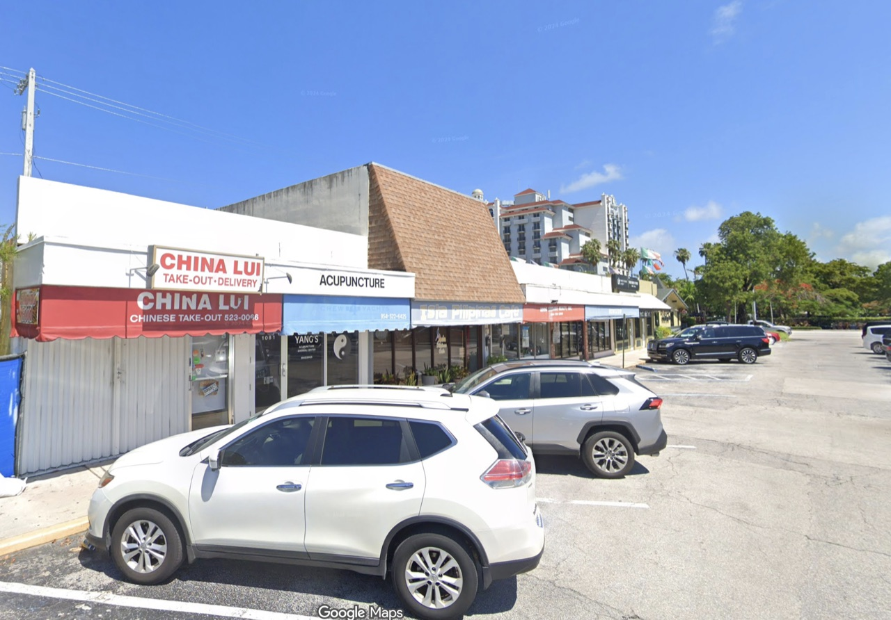
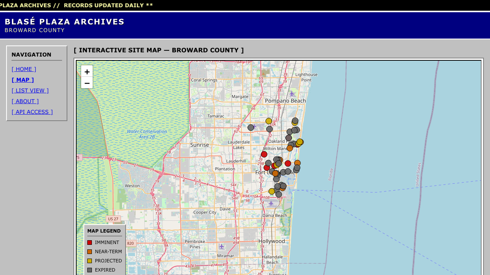

<p align="center">
  
</p>

# Blasé Plaza Archives

*A field survey and digital catalog of Broward County's shopping plazas.*

**[blaseplazas.com](https://blaseplazas.com)**

Blasé Plaza Archives documents the ordinary shopping plazas that make up much of Broward County, Florida's commercial landscape. The project treats the shopping plaza as a subject of field study: not necessarily because a particular plaza is architecturally remarkable, but because of its repetition, adaptation, and ubiquity throughout Broward County.

The archive focuses on the period just before demolition or renovation, when a site shows the most information — which units are vacant, how signage and infrastructure have degraded, how many tenants have turned over.

> ### ⚠️ This is a hobby project, and it changes constantly
>
> Blasé Plaza Archives is a personal project, not an official or institutional record. Records are added, reclassified, and corrected as the survey grows and as the underlying permit data shifts. The structure, the methodology, and the interpretation are all still settling, and breaking changes happen without ceremony.
>
> Treat everything here as a working document rather than an authoritative inventory of Broward County commercial property. For anything that matters, go to the source: the City of Fort Lauderdale permit records and the Broward County Property Appraiser.

## Dashboard



The dashboard provides an interactive way to explore the survey. Each documented plaza is represented as a site record containing location data, classifications, commercial observations, and comparative metrics. Users can explore individual sites or compare patterns across the larger collection.

| View | Description |
| --- | --- |
| Map | Sites plotted by coordinates, coloured by demolition horizon |
| List | Sortable, filterable table of all records |
| Report | The full survey document for a single site |
| API | Public read-only access, API key required |

## Two Layers

The dashboard automatically populates with shopping plazas identified through public data sources. These records form the starting point for the survey rather than the finished archive.

As new plazas appear in the dataset, I plan to visit each site in person. Field visits are used to confirm the accuracy of the underlying information, photograph the plaza, document its present condition, identify its commercial species, and complete the project's observational assessments.

This creates two layers of information: an automatically populated inventory of Broward County shopping plazas and a growing collection of sites that have been personally surveyed and documented in the field.

## Machine First, Person Second

Every plaza enters the archive as a machine-written record. Permit and parcel data are pulled from public sources, and Claude drafts the survey from them: the classification, the likely commercial species, the field notes, the comparative metrics. That first pass is fast, consistent, and produced entirely without anyone standing on the asphalt.

It is also, necessarily, an informed reconstruction. A model reading a 3,566 square foot building from 1960, zoned B-1, on a stretch of Federal Highway can infer a great deal about what that building probably is. It cannot tell you that half the units are papered over, that the sign still carries a business that closed in 2019, or that the parking lot has quietly become overflow for the church next door.

That is what the site visit is for. Visiting a plaza turns a plausible record into a documented one — confirming or correcting what the permit data implied, photographing the site, counting the vacancies, and recording the commercial species actually present rather than the ones predicted.

The automation exists to make the survey possible at all: one person cannot find every at-risk plaza in Broward County by driving around and hoping. The fieldwork exists to make it true. Neither half is sufficient alone, and the archive is explicit about which stage a given record is in — until a site has been visited, its report labels the metrics `INFERRED — NOT FIELD-VERIFIED` and carries a provenance block naming the source of every field.

## Survey Methodology

Each plaza is documented using the same general structure:

* **Horizon** — How near the plaza is to demolition or major renovation, taken from the status of its building permits. `IMMINENT` is an issued, active demolition permit; `NEAR-TERM` an issued renovation permit; `PROJECTED` a permit still in plan review; `EXPIRED` a permit whose work is complete or has lapsed.
* **Status** — The plaza's standing in the archive, restated from its Horizon: Demolition Pending, Renovation Pending, Declining, or Post-Intervention.
* **Classification** — The plaza's physical and commercial type, derived from the Florida Department of Revenue use code on the parcel.
* **Metrical Assessment** — A standardized group of comparative indicators.
* **Commercial Species Observed** — Dominant business types expected at the site.
* **Secondary Species** — Less prevalent businesses contributing to the site's commercial ecosystem.

## Metrical Assessment

| Metric | Description |
| --- | --- |
| Parking Entropy | Degree of disorder, circulation, and irregular use within the parking field |
| Shade Coverage | Relative availability of shade across pedestrian and parking areas |
| Signage Density | Concentration and visual prominence of commercial signage |
| Vacancy Ratio | Observed presence of vacant storefronts |
| Pedestrian Activity | Relative amount of pedestrian movement |

**On unvisited sites these are inferred, not measured.** No public dataset records parking entropy, shade, signage density, vacancy, or foot traffic. Until a plaza has been surveyed in person, the values are inferred by a language model from the permit record, parcel attributes, and corridor context, and the report labels the section `INFERRED — NOT FIELD-VERIFIED`. They are useful for comparing sites against one another, but they are not observations and should not be cited as measurements. Field visits replace them with values recorded on site.

## Site Records

A record contains:

```
Site ID · Plaza Name · Location · Coordinates · Survey Date
Horizon · Status · Classification · Architectural Style
Parcel Record        building area, zoning district, year built, use classification
Metrical Assessment  five inferred indicators
Commercial Species   dominant and secondary
Field Notes          one descriptive paragraph
Permit Reference     permit number, type, issue date, document reference
Data Provenance      the source of each class of field
```

Photographs are added when a site is surveyed in person.

## How the records layer is produced

Every record enters the archive from a government permit filing — no plaza is added by hand, and nothing is invented. Field survey builds on top of what this produces.

1. **Fetch** — Commercial demolition and alteration permits are pulled from the City of Fort Lauderdale permit feed. Two queries run: one for active demolition permits, one for the most recent filings. Void, withdrawn, purged, disapproved, and pre-application records are excluded.
2. **Collapse** — Multiple permits at one address become a single site, keeping the highest archive priority. A building with an active demolition permit is never displaced by a later renovation permit at the same address.
3. **Enrich** — The permit's parcel folio is joined against the Broward County Property Appraiser tax roll for building area, year built, and DOR use code. Zoning is resolved by point-in-polygon against the city zoning layer. Parcels whose use code shows residential, industrial, institutional, or government use are dropped.
4. **Generate** — A report is written by Claude from the permit and parcel record, in a fixed structure and a dry documentary register.
5. **Review** — Entries are staged as `pending_review` and are invisible on the public site and API until approved by hand.

A scheduled job runs nightly and queues newly filed permits. It never publishes; approval is always manual.

## Data Sources

| Dataset | Publisher | Used for |
| --- | --- | --- |
| [Building Permit Tracker](https://gis.fortlauderdale.gov/arcgis/rest/services/BuildingPermitTracker/BuildingPermitTracker/MapServer/0) | City of Fort Lauderdale | Permit records, addresses, coordinates, status |
| [Parcel Tax Roll](https://services.arcgis.com/JMAJrTsHNLrSsWf5/arcgis/rest/services/PARCEL_POLY_BCPA_TAXROLL/FeatureServer/0) | Broward County Property Appraiser | Building area, year built, DOR use code |
| [Zoning Districts](https://gis.fortlauderdale.gov/arcgis/rest/services/Accela/Accela/MapServer/4) | City of Fort Lauderdale | Zoning district |
| [Nominatim](https://nominatim.openstreetmap.org/) | OpenStreetMap | Geocoding fallback |
| [Claude](https://www.anthropic.com/) | Anthropic | Report text generation |

All three government datasets are public records, accessed without authentication. Accessed August 2026.

## Geographic Scope

The survey covers shopping plazas in Broward County, Florida.

**In practice, coverage is currently the City of Fort Lauderdale only.** Broward County publishes no countywide permit API. Permitting is delegated to its 31 municipalities, and the county's own portal is a server-rendered form with no machine interface. Fort Lauderdale is the only Broward municipality publishing a structured, actively maintained permit feed. The sync is built around a list of city sources so others can be added if they begin publishing.

The collection is ongoing. Sites represent documented observations rather than an exhaustive inventory of every shopping plaza in the county.

## Limitations

- **One city, not the county.** See above. The name describes the intent; the data describes Fort Lauderdale.
- **The metrics are inferred until a site is visited.** Parking entropy, shade, signage, vacancy, and pedestrian activity begin as model inferences from records. Field visits replace them with observations, so accuracy varies by layer.
- **No photographs yet.** The records layer is textual; images arrive with field visits.
- **Building area is parcel-level.** Square footage covers all buildings on the parcel, not the permitted work, so it can overstate a single tenant bay. Present on 33 of 48 records; the Property Appraiser does not publish it for every parcel.
- **`EXPIRED` conflates two outcomes.** A completed demolition and a lapsed permit both land there, so a plaza recorded as Post-Intervention may be demolished or may still be standing untouched. A site visit settles which, and separating the two will be streamlined as the field survey develops.
- **Unvisited records are machine-written.** Reports are drafted by a language model from permit and parcel data and reviewed before publication, but a record that has not been visited is an informed reconstruction rather than an observation. See [Machine First, Person Second](#machine-first-person-second).
- **Non-plazas can slip through.** Records whose parcel has no DOR use code are kept rather than discarded, since excluding them would lose real plazas. A few offices or mixed-use buildings are included as a result.
- **Window starts in 2023.** Earlier filings are not synced.

## Project Structure

A pnpm workspace monorepo.

```
Blase-Plaza-Archives/
├── artifacts/
│   ├── api-server/           Express 5 API — permits, surveys, admin, public v1
│   │   └── src/
│   │       ├── routes/       surveys · permits · admin · apiV1 · apiKeys · health
│   │       └── services/     surveyGenerator (Claude) · geocoder
│   ├── blase-plaza/          React + Vite frontend (1990s municipal aesthetic)
│   │   └── src/pages/        Home · Map · List · Report · About · ApiAccess
│   └── mockup-sandbox/       Component preview sandbox
├── lib/
│   ├── db/                   Drizzle ORM schema and connection
│   ├── api-spec/             OpenAPI spec + Orval codegen config
│   ├── api-zod/              Generated Zod schemas
│   ├── api-client-react/     Generated React Query hooks
│   └── integrations-anthropic-ai/
├── scripts/src/cron.ts       Nightly permit sync
└── .github/workflows/        Scheduled sync
```

**Stack:** TypeScript · Express 5 · PostgreSQL + Drizzle · React + Vite · Leaflet · Zod · esbuild · Claude

## Running Locally

```bash
git clone https://github.com/b-urge/Blase-Plaza-Archives.git
cd Blase-Plaza-Archives
pnpm install
```

Set the required environment:

| Variable | Purpose |
| --- | --- |
| `DATABASE_URL` | PostgreSQL connection string |
| `AI_INTEGRATIONS_ANTHROPIC_API_KEY` | Anthropic API key |
| `AI_INTEGRATIONS_ANTHROPIC_BASE_URL` | Anthropic API base URL |
| `ADMIN_PASSWORD` | Bearer token for the admin routes |

Create the schema, then run the API and frontend:

```bash
pnpm --filter @workspace/db run push
```

```bash
pnpm --filter @workspace/api-server run dev
```

```bash
PORT=5173 BASE_PATH=/ pnpm --filter @workspace/blase-plaza run dev
```

Populate the database from live permit data:

```bash
curl -X POST localhost:3000/api/permits/sync -H "Authorization: Bearer $ADMIN_PASSWORD"
```

Entries are staged for review. Approve them at `/api/admin`.

## API

Read-only public access, unauthenticated. `/api/surveys` already served the same records without a key, so requiring one here gated a side door while the front door stood open.

```
GET /api/v1/plazas              list records; filter by horizon, classification
GET /api/v1/plazas/{site_id}    a single record
```

Unreviewed entries are never returned.

## Who cares about shopping plazas?

Me! I grew up in the suburbs of the greater Fort Lauderdale area, and some of my earliest memories are of strip plazas so ordinary I never thought twice about them. That was the point. They were just part of daily life, quiet portraits of the neighborhoods around them. It wasn't until I watched them change, stores closing, signs repainted, familiar businesses gone, that I realized no one was keeping track. Broward's strip plazas are too plain to celebrate but too important to ignore. Blasé Plaza Archives treats them as sites worth documenting, digging into their histories and recording them before they change beyond recognition. By combining fieldwork with research into property records, ownership, and local demographics, I want to build a public website where anyone can explore profiles of at-risk plazas across Broward County. It's both a tool and a record, one that asks what we lose when these places are erased, and what it means when they're replaced.

## License

Source code is MIT licensed — see [LICENSE](LICENSE).

The underlying permit, parcel, and zoning data are Florida public records and are not covered by that license; consult the publishing agencies for their terms. Generated report text is produced by a language model from those public records.
